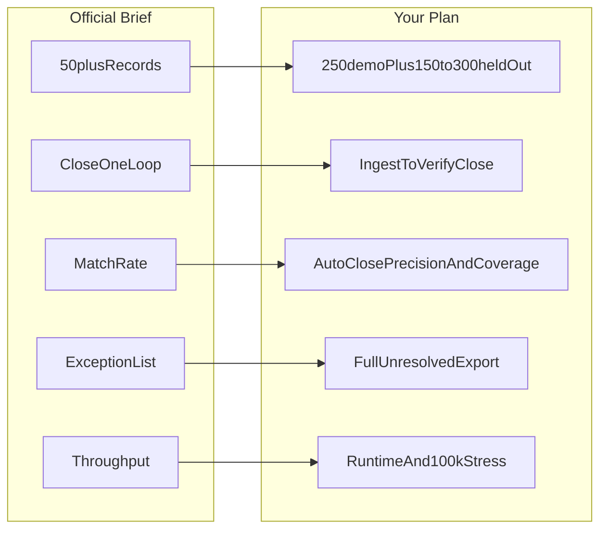
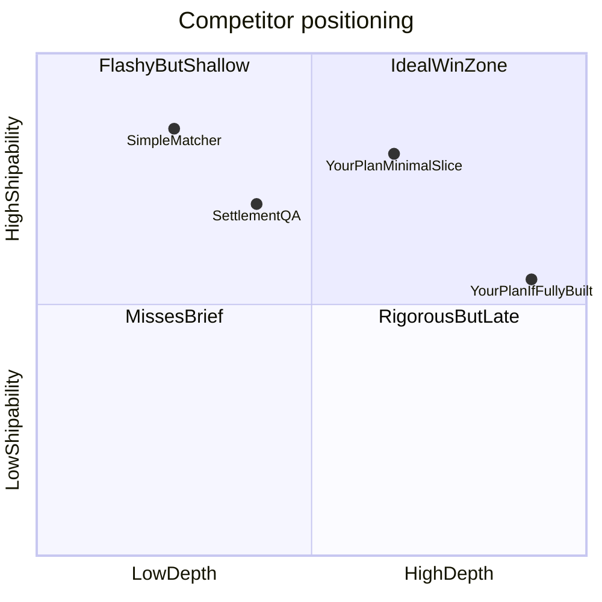

# Razorpay Reconciliator Plan Review

## Official problem statement (what judges will score against)

From the [Razorpay AI Buildathon brief](https://razorpay.com/buildathon/):

| Requirement | Official bar |
|---|---|
| Track | **04 — AI Finance Controller** — "Run the books and the cash position" |
| Direction | **Multi-source reconciliation** (one of four example directions) |
| Core deliverable | Agent that **closes one finance-ops loop** on **50+ synthetic records** |
| Metrics | **Throughput + measured accuracy + honest exception list** |
| Anti-pattern | "One cherry-picked match proves nothing" |
| Submission | Public repo + **5-minute pitch video** + architecture (deadline **5 Sep 2026**) |

Other listed directions (Settlement Q&A, Forward cash forecaster, Tax-line matcher) are alternatives—you chose the strongest fit for a Razorpay-native build.

---

## Alignment verdict: **Strong (9/10)**

Your plan in [`Razorpay_AI_Finance_Controller_Winning_Plan (2).md`](Razorpay_AI_Finance_Controller_Winning_Plan (2).md) maps cleanly to every explicit requirement and goes deeper than the brief on finance correctness—which is appropriate for this track.

### What aligns exceptionally well

1. **Multi-source reconciliation (not two-CSV matching)**
   - Sources: Razorpay activity + combined recon + settlement headers + bank CSV + aggregate GL (+ optional merchant orders).
   - This is genuinely multi-source and Razorpay-shaped—not generic reconciliation.

2. **Closed finance-ops loop**
   - Your loop (ingest → validate → reconcile → investigate → approve → bounded action → re-verify → close/escalate) exceeds the brief's minimum and directly mirrors Razorpay's own reconciliation guide cited in Section 2.1.

3. **50+ records**
   - Demo snapshot (~250 payments) and held-out benchmark (150–300 control decisions) clearly satisfy and exceed the floor.

4. **Honest metrics philosophy**
   - `False auto-closes = 0`, full exception export, separate denominators, Wilson intervals, and refusal to headline a single "match rate" directly address the brief's anti-gaming stance.
   - You still define **settlement-bank match rate** and **full-chain proven rate**—good; make one of these the video headline number judges expect.

5. **Throughput**
   - Records/sec, p95 latency, and a separate 100k deterministic stress run satisfy the throughput bar without conflating it with accuracy.

6. **Razorpay domain depth (major differentiator)**
   - Two-balance model (Gateway Clearing vs Settlement-in-Transit) correctly handles `processed ≠ bank credited`, T+2 timing, partial settlements, and `Σcredit − Σdebit` batch math.
   - Most public competitor repos (ReconLoop, reconciliation-assistant) stop at order↔payment or ledger↔settlement two-source matching—your plan correctly identifies this crowded baseline in Section 2.4.

7. **AI used meaningfully (not cosmetically)**
   - Rules own money; LLM does read-only evidence investigation with tool calling, abstention, and structured output.
   - Phase 0 go/no-go on AI value (10pp top-1 or 20% review-time reduction) is exactly the kind of rigor Razorpay's "verification capacity" framing rewards.

8. **Submission artifacts**
   - Sections 12, 16, 17 cover repo layout, demo script, README checklist, and architecture—matching submission expectations.

---

## Where alignment is good but needs careful execution

| Area | Plan strength | Judge risk if mishandled |
|---|---|---|
| **Match rate wording** | You reframe around precision/coverage | Panel may still ask "what's your match rate?"—prepare a one-line answer with denominator |
| **AI necessity** | Ablation study planned | If rules handle 90%+ and agent adds little, judges may call it "LLM wrapper" |
| **Synthetic data** | API-shaped, anti-leakage discipline | Without independent challenge fixtures, metrics look self-serving |
| **Resolution loop** | One approved journal → re-verify | If journal posting slips, you lose the main differentiator vs matchers |
| **Customer wedge** | External orders + aggregate Tally journals | Narrow wedge is smart but unvalidated until 5 interviews happen |

---

## Is this a foolproof winning plan?

**No.** No hackathon plan is foolproof. This is a **high-upside, high-execution-risk** plan—not a guaranteed win.

### Why it could win

- Goes **deeper than the brief** in the right dimensions: settlement batches, UTR/bank proof, GL roll-forwards, audit trail, abstention.
- Correctly avoids the **crowded "fuzzy matcher + chatbot"** trap.
- Demonstrates **systems thinking** Razorpay likely wants in AI Builder Interns: bounded agents, deterministic money controls, honest evaluation.
- The 5-minute demo script (Section 16) tells a compelling story: clean proof → real resolution → honest abstention → audit pack.

### Why it could lose (ranked by severity)

1. **Scope vs. time (critical)**
   - The plan describes ~10 days of work for what is realistically **4–6 weeks of senior-engineer scope**: four controls, symptom graph, investigation agent, three UI surfaces, property tests, independent benchmark, CA review, customer interviews, ablation study.
   - Repo today contains **only the plan file**—zero implementation. Execution risk is maximum.

2. **Perfectionism over shippable demo**
   - Wilson CIs, bipartite hypothesis matching, 100k stress runs, and 26-scenario matrices are excellent—but any one of these can consume days that should go to the **three demo paths** (missing journal, ambiguous UTR, SLA breach).

3. **External gates may not happen**
   - 5 customer interviews, CA sign-off, 3-person timing study, and independently authored AI challenge set are credibility boosters—but the plan correctly says to downgrade claims if they don't happen. Without them, the "winning wedge" remains hypothesis.

4. **Judges may reward polish over depth**
   - A simpler two-source matcher with a slick Streamlit UI and a clean 95% match rate video may **feel** more complete than a rigorous partial build with many `REVIEW_REQUIRED` states—especially if your auto-close coverage is honestly low (~50–70%).

5. **Differentiation only matters if visible in 5 minutes**
   - Two-balance roll-forward and journal re-verification must be **on screen**, not buried in docs. If the demo defaults to batch matching, you look like everyone else.

6. **AI fallback could undermine the "agent" narrative**
   - Cached/no-LLM fallback is correct for reliability, but the video must show **live tool-calling investigation** on at least one case.

---

## Gap analysis vs. official brief (minor gaps only)

| Brief item | Plan coverage | Gap? |
|---|---|---|
| 50+ synthetic records | Yes, exceeded | None |
| Close one finance-ops loop | Yes | None |
| Match rate | Yes (multiple metrics) | Reframe for judges—see below |
| Honest exceptions | Yes | None |
| Throughput | Yes | None |
| Meaningful AI | Yes, with ablation | Must prove in demo |
| Public repo + video + architecture | Planned | **Not built yet** |
| Failure handled gracefully | Section 16 (abstention, model failure) | Must be in video |

**No material misalignment with the problem statement.** The plan is directionally correct and arguably over-indexed on rigor vs. the brief's minimum bar.

---

## Competitive positioning

- **Simple matchers**: ship fast, may look "done," but violate finance semantics (1:1 payment→bank).
- **Your full plan**: deepest, but only wins if the **minimal vertical slice** ships completely.
- **Sweet spot to target**: Section 15 "Frozen MVP" items 1–6—not the full 1150-line spec.

---

## Recommended scope cuts (to maximize win probability)

Keep the thesis; cut everything that doesn't appear in the 5-minute video:

**Must ship (non-negotiable for differentiation)**
1. Razorpay recon + settlement + bank + GL adapters (even CSV-only)
2. Control 2 (batch `Σcredit − Σdebit`) + Control 3 (UTR bank match)
3. One Control 4 path: missing fee journal → approve → demo-ledger post → re-verify
4. One AI investigation path with tool calls + one abstention
5. Dashboard with: proven / pending / review / escalated counts + **full exception export**
6. Headline metrics: auto-close precision (0 false closes), settlement-bank match rate, throughput, exception count

**Defer without hurting alignment**
- Two-balance roll-forward (fallback already in plan: ship batch→bank→journal only)
- 100k stress run (report demo-scale throughput instead)
- Customer timing study (skip quantified time-saved claims)
- Rule-learning proposals, maker-checker simulation, FastAPI/React
- Hypothesis macro-F1 and bipartite matching (report simpler confusion matrix)

**Do before coding (1–2 days max, not 5 interviews)**
- 2–3 quick conversations with a CA/finance friend to validate journal templates—not a formal 5-interview study
- Freeze golden journals in `docs/accounting-model.md`

---

## Demo and pitch adjustments for judges

Your Section 16 script is strong. Add these judge-facing tweaks:

1. **Open with the brief's words**: "50+ records, one closed loop, match rate, and every exception we couldn't resolve."
2. **Show match rate early** (minute 1:10): e.g. "87% settlement-bank match, 100% auto-close precision, 14 escalated exceptions listed here."
3. **Name the failure you handled**: ambiguous UTR abstention + model timeout fallback (brief explicitly values this across tracks).
4. **Don't oversell production-readiness**—your claim discipline (Section 13) is correct; use it in the pitch.

---

## Final scores

| Dimension | Score | Notes |
|---|---|---|
| Problem-statement alignment | **9/10** | Matches track, direction, metrics, and anti-patterns |
| Differentiation vs. competitors | **8/10** | Strong if four-control chain ships; weak if only matching ships |
| Feasibility (as written) | **4/10** | Too much for hackathon timeline; repo empty |
| Feasibility (frozen MVP only) | **7/10** | Achievable in ~2 weeks focused build |
| Win probability (full plan) | **~25–35%** | High ceiling, high failure rate |
| Win probability (scoped MVP) | **~50–65%** | Competitive if demo is crisp and metrics honest |

---

## Bottom line

**Your plan is one of the most rigorous Track 04 / multi-source reconciliation strategies possible.** It aligns with the problem statement, correctly interprets Razorpay settlement mechanics, and avoids the traps that will disqualify generic matchers.

**It is not foolproof.** Winning depends on **ruthlessly executing the Frozen MVP (Section 15)** and making the differentiation **visible in 5 minutes**—not on implementing the full evaluation science, customer discovery program, or enterprise control framework.

**Recommended decision:** Keep the plan as your north star, but treat Sections 15.1–15.6 (items 1–6) as the actual submission scope. Everything else is stretch. Start building immediately—the plan is ready; the product is not.
