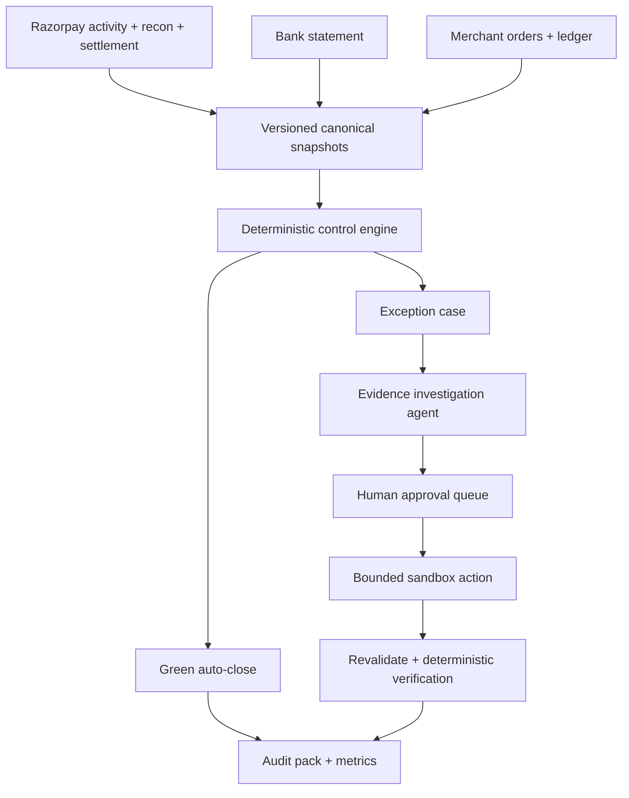

# Razorpay Reconciliator: Evidence-Driven Multi-Source Settlement Reconciliation Agent

## Razorpay AI Buildathon — Track 04: AI Finance Controller

**Product promise:** Every settlement is proven, pending with reason, or escalated with evidence.

**Chosen scope:** One domestic-INR merchant whose orders originate outside Zoho Books, one Razorpay account, one bank account, and one accounting ledger with event-appropriate aggregate journals. Razorpay Reconciliator controls the expected merchant-book Razorpay Clearing and Settlement-in-Transit balances across payment/refund events, settlement batches, bank credits, and accounting entries.

**Winning thesis:** Do not build another two-CSV fuzzy matcher. Build a finance control that proves that each settlement is internally correct, actually reached the bank, was posted correctly to the ledger, and—when something breaks—drives the exception to an approved resolution with evidence.

---

## 1. What the evaluator is likely to reward

The public brief asks for a finance-ops loop over at least 50 synthetic records, with throughput, measured accuracy, and an honest exception list. A strong evaluator will go beyond the words and test six things:

| Evaluator question | Evidence Razorpay Reconciliator must show |
|---|---|
| Is this a real finance problem? | Razorpay-shaped data, batch settlement logic, UTR-to-bank matching, fees/tax/refunds/adjustments, and ledger posting—not generic CSV rows. |
| Does it close a loop? | Ingest → validate → reconcile → investigate → approve → execute a bounded resolution → verify → close. |
| Is AI necessary? | AI performs read-only evidence investigation across ambiguous narrations, candidate records, and missing sources; code controls all amounts, dates, identities, balances, actions, and posting rules. |
| Can I trust it with money? | Integer paise/Decimal arithmetic, hard invariants, deterministic evidence strength, no LLM-authored amounts, human approval, idempotency, and an append-only audit trail with an exported run digest. |
| Are the results honest? | Blind challenge labels, precise decision-level denominators, confidence intervals, false-auto-close count, abstentions, and all unresolved records. |
| Is it more than a demo? | Real Razorpay API-shaped adapter, bank/ERP adapters, replayable runs, failure handling, tests, observability, and a clear production boundary. |

### Non-negotiable release gate

The system must never optimize match rate at the cost of false clearing. The headline control metric is:

> **False auto-closes = 0 on the held-out test set.**

A lower auto-close rate with honest abstention is better than a high match rate produced by force-matching ambiguous money movements.

---

## 2. Market research: what is still manual

### 2.1 Evidence from finance teams

A 2025 Kani Payments survey of 250 UK payment-industry professionals found that 44% used a partially automated mix of tools and spreadsheets; data collection, matching, and exception management were major bottlenecks. It reported 700+ hours per year on data preparation and that 82% struggled to deliver reports on time. It also found 56% had total or partial spreadsheet reliance. This is not an India-specific benchmark, but it is strong directional evidence from payment businesses with a transparent sample and methodology.

A 2025 Ledge survey of 100 finance professionals reported cash reconciliation as the most time-consuming close activity. Respondents commonly used 3–5 systems and spent 20–50 hours per month on cash reconciliation; 94% used Excel during month-end close. This is vendor research and should be presented as directional, not universal.

Razorpay's own reconciliation guide describes the manual loop: gather internal and external records, compare amounts/dates/descriptions, investigate timing differences, missing transactions and fees, correct accounting records or contact the bank, and document the result. That sequence directly motivates the agent workflow.

### 2.2 Razorpay-specific operational facts that shape the product

Razorpay's Settlement Recon API can return **payments, refunds, transfers, and adjustments** with debit/credit, fee, tax, settlement ID, UTR, payment/order identifiers, timestamps, and other evidence. This means a real reconciliation cannot assume one sale equals one bank credit.

Razorpay documents that:

- a settlement includes payments plus deductions/adjustments such as fees, tax, transfers, and refunds;
- the settlement UTR is the bank-side trace key;
- `settlement.processed` means the fund transfer was initiated, not necessarily that the bank credited it; the credit can take up to the normal bank-rail timeline;
- domestic settlements normally follow a T+2 working-day cycle, subject to banking calendars and merchant-specific conditions;
- partial settlements can occur when refunds or the live balance prevent all scheduled transactions from settling together;
- settlement reports connect transactions to settlement IDs.

These facts create the genuinely manual work that Razorpay Reconciliator targets: collecting files, normalizing schemas, grouping transaction lines into settlement batches, reconstructing net cash, locating the bank credit, explaining timing/amount breaks, identifying accounting entries, and documenting corrective action.

### 2.3 Current solutions and the remaining opportunity

The baseline is stronger than “spreadsheets only”:

- Razorpay already provides settlement IDs, UTRs, break-ups, recon exports/APIs, reports, and status information.
- Zoho Books' official Razorpay integration uses webhooks, creates a Razorpay Clearing account, displays consolidated sales and fees, shows what Razorpay owes, and supports bank matching/reconciliation.
- Tally supports bank-reconciliation and connected-banking workflows, although the standard workflow is not a Razorpay-native clearing roll-forward across merchant-originated orders, recon batches, bank credits, and corrective aggregate journals.
- HighRadius and BlackLine advertise rule-driven 1:1, 1:N and N:N matching, exception queues, approvals, suggested corrections, dashboards, and audit trails.

A winning project must not present any of those capabilities as novel. The precise wedge is:

> A merchant whose orders originate in an ecommerce/custom system outside Zoho Books and whose accounting team posts aggregate journals into Tally or a custom ERP must prove the expected merchant-book Razorpay Clearing/Transit roll-forwards, settlement-batch cash, bank receipt, and GL posting, then resolve incorrect/missing journals with evidence.

| Existing option | Verified strength | Remaining gap Razorpay Reconciliator must prove—not merely claim |
|---|---|---|
| Razorpay Dashboard/recon API | Authoritative settlement lines, IDs, UTR, fees/tax, status, reports | Does not by itself prove the merchant's external order subledger and aggregate GL correction workflow |
| Zoho Books Razorpay integration | Webhook sync, Razorpay Clearing account, consolidated sales/fees, amount owed, bank matching | Wedge applies only when orders/accounting originate outside this native Zoho flow or aggregate custom postings break |
| TallyPrime standard banking/e-payment tools | Bank-ledger and reconciliation/status workflows | Not a prebuilt Razorpay-native evidence graph connecting payment activity, recon batch, transit balance, bank UTR, and correction approval for this external-order scenario |
| HighRadius/BlackLine | Enterprise-scale transaction matching, workflows, exceptions, approvals, audit features | Broad enterprise products; Razorpay Reconciliator competes on a focused Razorpay-shaped prototype and transparent benchmark, not feature breadth |
| Public Buildathon recon projects | Exact/fuzzy matching, confidence, explanations, exception exports; some many-to-one and ground truth | Most stop at two-source matching or suggestion rather than two-balance proof plus executed/reverified aggregate journal |

This matrix establishes a hypothesis, not proof of demand. The interview gate below must confirm it.

The opportunity is therefore a focused control and investigation layer rather than a replacement for Razorpay or the ERP:

1. Reconcile authoritative Razorpay payment/refund activity into an as-of clearing-account roll-forward.
2. Prove settlement-batch cash using Razorpay's signed debit/credit semantics.
3. Link that cash to the correct bank account and UTR evidence.
4. Detect incorrect or missing **aggregate** GL postings.
5. Assemble a source-cited exception packet and execute one approved corrective journal in a demo ledger, followed by deterministic re-verification.

### 2.4 Buildathon competitor scan

Public 2026 Buildathon repositories already show a crowded baseline:

- two-source bank/ledger or ledger/settlement matching;
- exact and fuzzy ID passes;
- LLM-written exception explanations;
- confidence thresholds;
- exception CSVs and simple dashboards;
- some many-to-one matching and ground-truth validation.

Therefore, **“fuzzy matching plus a chatbot” is not differentiated**. Razorpay Reconciliator must visibly complete the four-control chain and execute an approved resolution.

### 2.5 Required customer validation before final submission

Desk research is insufficient to prove the wedge. Before freezing the build, conduct at least five 20-minute interviews with a mix of D2C/ecommerce finance operators, accountants, controllers, and practicing CAs. Ask them to screen-share or describe:

- the exact files/screens used for Razorpay reconciliation;
- whether customer orders originate inside or outside the accounting product;
- whether GL posting is per transaction, per settlement, or daily aggregate;
- opening/ending clearing-balance treatment;
- the three most frequent exception types;
- time to investigate and who approves corrections;
- what Razorpay Dashboard, Zoho Books, Tally, or current spreadsheets fail to resolve.

Record an anonymized evidence table in the repository: participant role, current sources, manual steps, repeated break, current workaround, and product implication. Do not fabricate time-saved claims if interviews cannot validate them.

**Validation gate:** At least three of five participants must confirm the chosen missing/misclassified aggregate-journal workflow occurs in practice, or the MVP exception path must change before implementation.

---

## 3. Exact user and job-to-be-done

### Primary user

Finance operations analyst or controller at an Indian online merchant using Razorpay and an accounting system such as Tally, Zoho Books, NetSuite, or an internal ledger.

### Daily job

> “As of today's cutoff, prove the expected merchant-book Razorpay Clearing and Settlement-in-Transit balances, verify each eligible settlement and bank credit, and confirm the required journals. For any break, show the evidence and prepare the safest next action without hiding legitimate in-transit cash.”

### Scope boundary for the hackathon

Included:

- domestic INR settlements;
- normal and partial settlements;
- payments/refunds/fees/tax for automatic accounting control; transfers/adjustments for signed batch proof and review only;
- authoritative Razorpay payment/refund events or API-shaped snapshots, combined recon data, settlement header/webhook data, bank statement, and aggregate accounting ledger;
- daily batch reconciliation;
- versioned merchant policy: timezone, bank calendar, settlement cycle, arrival SLA, materiality, chart-of-account mapping, and excluded products;
- human-approved corrective aggregate journal posted into a demo ledger and re-verified;
- evidence-complete support escalation that remains `ESCALATED`, never `CLOSED`;
- offline synthetic mode plus an API adapter.

Explicitly excluded from v1:

- multi-currency accounting and FX gains/losses;
- GST filing or tax advice;
- autonomous posting to a live ERP;
- live movement of money;
- dispute/chargeback evidence workflows;
- multiple PSPs, entities, or bank accounts;
- learning rules automatically without finance-owner approval.
- Instant Settlements and other separately priced settlement products unless a distinct arithmetic policy is implemented.

These exclusions make the claim credible and the demo finishable.

---

## 4. The finance-ops loop Razorpay Reconciliator closes

### Control 1 — Two as-of balance roll-forwards

The combined Settlement Recon API contains settled lines; absence from it does **not** prove that a captured payment is missing. A processed settlement that has not reached the bank is also no longer gateway clearing—it is settlement-in-transit. Razorpay Reconciliator therefore models two separate assets.

**Gateway Clearing**

`expected_gateway_end = gateway_open + captured_payments + signed_credit_adjustments - refunds - transfers - recognized_fees - processed_settlements - signed_debit_adjustments`

**Settlement-in-Transit**

`expected_transit_end = transit_open + processed_settlements - verified_bank_credits - supported_reversals`

Exact v1 state timing:

| Economic event | Gateway Clearing | Settlement-in-Transit | Bank |
|---|---:|---:|---:|
| Payment becomes captured | `+gross payment` | — | — |
| Refund is processed from gateway balance | `-refund amount` | — | — |
| Normal settlement is `created` | — | — | — |
| Normal settlement becomes `processed` | `-net settlement` | `+net settlement` | — |
| Processing fees become evidenced in the settled recon lines | `-fee total once` | — | — |
| Matching bank credit appears | — | `-net settlement` | `+net settlement` |
| Settlement is `failed` before processing | — | — | — |

Post-processed reversal/failure, Route transfers, and unexplained adjustments are ingested and visible but remain unsupported for automatic GL close in v1 unless an explicit signed-delta and journal policy is implemented. They can still participate in the primary settlement-batch cash equation through Razorpay's authoritative `credit`/`debit` values.

Legitimate captured-but-not-yet-settled amounts remain in Gateway Clearing. Processed-but-uncredited amounts remain in Settlement-in-Transit. Neither is mislabeled as missing cash.

#### Independent balance evidence

The hackathon does **not** claim an independently verified Razorpay platform balance unless an actual Razorpay balance/report control total is supplied. Its implemented control is a derived provider subledger tied to independently supplied merchant-GL control balances:

- opening and closing Gateway Clearing balances from the GL trial balance/control-account export;
- opening and closing Settlement-in-Transit balances from the same independent GL source;
- opening/closing bank statement balances and running-balance continuity.

The synthetic benchmark contains separate balance snapshots/control totals. Removing an activity row must not regenerate those snapshots. If independent balances/control totals are absent, the roll-forward status is `BALANCE_UNVERIFIED` and cannot green-close.

Every run records cutoff, economic timestamps, timezone, data watermarks, source versions, pagination status, report identifiers, opening/closing balances, and unexplained deltas.

### Control 2 — Settlement batch integrity

Group Razorpay recon lines by `settlement_id`. Razorpay's recon `credit` and `debit` already represent signed account movement, so the primary normal-settlement invariant is:

Hard invariant:

`sum(line.credit) - sum(line.debit) == settlement_header.amount`

Do **not** subtract `fee` or `tax` again from this net equation. `amount`, `fee`, and `tax` are validated separately through versioned per-transaction-type rules and official-shaped golden fixtures. Instant Settlements are excluded from v1 to prevent mixing normal-settlement and instant-settlement fee semantics.

Supported v1 component rules, based on the documented combined-recon semantics and verified against official-shaped fixtures:

| Recon line | Required component invariant |
|---|---|
| Payment | `debit = 0` and `credit = amount - fee` |
| Refund with no separate fee | `credit = 0`, `debit = amount`, `fee = 0` |
| Transfer | `credit = 0` and `debit = amount + fee`; batch cash is supported, automatic GL close is not |
| Credit adjustment | `debit = 0`, `credit = amount`, `fee = 0`; automatic GL close is not supported |
| Debit adjustment | `credit = 0`, `debit = amount`, `fee = 0`; automatic GL close is not supported |

For supported fixtures, `tax` is treated as an informational component **within** `fee`, not an additional cash deduction: `0 ≤ tax ≤ fee`. Thus payment base fee expense is `fee - tax`, tax classification is `tax`, and their sum equals the single cash deduction `fee`. Any observed line that violates or falls outside these frozen contracts is `UNSUPPORTED_LINE_SEMANTICS`, not force-normalized.

For every line type, golden tests include a valid official-shaped example plus independent mutations to amount, credit/debit, fee, tax, sign, and settlement ID.

All amounts are represented in paise as integers or exact decimal values—never binary floats.

### Control 3 — Cash receipt

Match the settlement header to the bank credit using the correct bank account, credit direction, INR currency, normalized UTR, amount, and value-date policy. UTR is strong evidence, but source completeness and duplicate/conflict checks must also pass.

Important state distinction:

- `PROCESSED_AWAITING_BANK`: transfer initiated; still inside the allowed arrival window.
- `MISSING_BANK_CREDIT`: arrival window breached and no matching bank credit exists.

The project must not call a processed webhook “cash received.”

### Control 4 — Event-appropriate accounting posting

The hackathon implements one exact synthetic accounting policy, but not every event can be aggregated by settlement: captured payments may not yet have a settlement ID and partial settlement can split one capture day across later payouts.

Golden journals and aggregation (account IDs are fixed in merchant configuration):

| Economic event | Aggregation key | Debit | Credit | Amount |
|---|---|---|---|---:|
| Captured customer payments against booked receivables | Daily capture batch by economic capture date, with payment-level evidence links | Gateway Clearing | Customer Receivable | gross captured amount |
| Processed refunds funded from gateway balance | Daily refund batch by economic processing date, with refund-level evidence links | Customer Refunds / configured refund account | Gateway Clearing | refund amount |
| Normal settlement becomes processed | One journal per settlement | Settlement-in-Transit | Gateway Clearing | settlement net amount |
| Fee evidenced by settled recon | Settlement-level aggregate | Gateway Fee Expense and/or Fee Tax Suspense | Gateway Clearing | one total equal to `fee`; split is `fee-tax` and `tax` |
| Bank credit verified | One journal per verified bank credit | Bank | Settlement-in-Transit | settlement net amount |
| Approved correction | One journal per immutable approved action version | Template-specific | Template-specific | Deterministic evidence amount |

Tax is never deducted twice and is not automatically claimed as input GST. The default v1 posts `tax` to a configured Fee Tax Suspense/expense account. A production merchant may configure eligible Input GST only with required documentary evidence and professional review; that path is not implemented in the hackathon. V1 recognizes processing fees when they are evidenced in settled recon under its synthetic merchant policy; this timing is configurable in real accounting and is not claimed as the only correct policy.

Transfers and adjustments are included in signed settlement-batch proof, but their GL control is `REVIEW_REQUIRED_UNSUPPORTED_POLICY` in v1. This is preferable to inventing a counter-account.

Implemented correction templates are separate and immutable:

1. **Missing fee/tax-suspense posting:** debit configured fee expense (`fee-tax`) and tax suspense (`tax`); credit Gateway Clearing for total `fee`.
2. **Misclassified fee posting:** debit correct configured expense; credit the observed incorrect expense for the same amount; Gateway Clearing must remain unchanged.
3. **Missing processed-settlement reclassification:** debit Settlement-in-Transit; credit Gateway Clearing for net settlement, only when authoritative processed evidence exists.

No template creates a Bank debit without authoritative bank evidence. Razorpay Reconciliator verifies the resulting trial balance, both roll-forwards, event-appropriate aggregation, account mappings, amount, currency, economic/posting date, and 1:N/N:1 evidence links. The LLM never selects ledger accounts or monetary values.

### Resolution loop

Every investigation case receives:

1. one or more rule-owned failed/ambiguous control decisions;
2. cited evidence from source records;
3. an AI-generated, non-binding hypothesis/explanation with supporting, contradicting, and missing evidence;
4. a proposed action from an allowlisted action catalog;
5. risk and deterministic evidence strength;
6. human approve/reject/edit;
7. execution once in a versioned demo ledger or creation of an evidence-complete escalation;
8. post-action verification;
9. an append-only audit event, exported run digest, and precise outcome: `RESOLVED`, `PENDING_EVIDENCE`, `ESCALATED`, or `UNRESOLVED`.

One defect may break several controls. Razorpay Reconciliator creates one observable investigation case with linked symptoms when evidence supports the link, rather than inflating metrics with four independent exceptions.

---

## 5. Highest-value manual problems to automate

| Manual problem | Why rules alone struggle | Razorpay Reconciliator method | Safe outcome |
|---|---|---|---|
| Files use different columns, date formats, signs, and narration styles | Format drift creates brittle import scripts | V1 uses fixed versioned source profiles and deterministic validators; unexpected schemas are blocked for human mapping | Safe ingestion or explicit `SOURCE_SCHEMA_UNMAPPED` |
| One bank credit represents many payment/refund/fee lines | A naive 1:1 matcher produces false exceptions | Group by settlement ID/UTR; deterministic batch arithmetic reconstructs net cash | Batch is auto-cleared only if invariants pass |
| Bank narration truncates or rearranges the UTR/reference | Exact string joins fail | Candidate blocking by amount/date, then AI/semantic parser extracts and compares reference tokens | Suggestion goes to review unless hard identity evidence exists |
| `processed` settlement has not reached the bank | Status semantics and timing are easy to misread | State machine uses event time, bank calendar, and arrival-window policy | Wait inside SLA; escalate only after breach |
| Fee/tax/refund/adjustment is absent or misposted in books | Analyst must reconstruct components and find the wrong ledger line | Rules compute expected components; agent explains the gap and selects a predefined journal template | Balanced draft journal, human approved |
| Same amount occurs repeatedly, creating several plausible matches | Fuzzy scores can force the wrong pair | Rank candidates with deterministic evidence features; abstain when evidence is insufficient or candidate margin is low | Honest ambiguity with top candidates and missing evidence |
| Exception investigation spans dashboards, CSVs, and emails/notes | The task is multi-step and evidence-intensive | Investigation agent queries allowlisted tools, builds an evidence packet, and stops when sufficient or blocked | Faster review with traceable evidence |
| Analysts repeatedly solve the same exception pattern | Knowledge remains tribal or in spreadsheet comments | After approval, agent proposes—not activates—a new deterministic rule with before/after backtest | Finance owner can promote a tested rule |
| Audit evidence is assembled after the fact | Screenshots and comments are incomplete | Every source, rule, model output, approval, and action is event-logged with versions | One-click audit pack |

---

## 6. Why this is an AI agent—not an LLM wrapper

### One narrow AI job to prove

The headline AI contribution is **exception investigation**, not financial matching:

> Given an ambiguous canonical case, choose which evidence to retrieve, recover noisy references from unstructured bank/ERP narrations, rank supported hypotheses, identify missing evidence, and produce a cited resolution packet or abstain.

This job is measured against rules + RapidFuzz on unseen narration formats and timed human review tasks. If AI does not improve candidate top-k accuracy, evidence completeness, or analyst investigation time without increasing false clears, it should not be claimed as a product advantage.

### Agent responsibilities

The agent receives a reconciliation case and may call only these tools:

- `fetch_source_record(source, id)`
- `search_candidate_records(filters)`
- `calculate_batch(settlement_id)`
- `get_policy(policy_id)`
- `get_action_catalog(case_type)`

It plans a **read-only** investigation, gathers evidence, and returns a structured non-binding hypothesis plus recommended next step. The next tool call must depend on retrieved evidence; a fixed chain of calls plus generated prose does not qualify.

A deterministic workflow engine—not the LLM—validates an action template, creates the draft, requests approval, executes the exact approved version, and verifies the result. No model output or tool sequence can invoke a ledger write.

The case is stateful: it can wait for new evidence, re-investigate after a source refresh, and reopen/supersede a prior result under a new cutoff. At least one demo case must end in `INSUFFICIENT_EVIDENCE` rather than a forced hypothesis.

### What the LLM is allowed to do

- interpret unstructured descriptions and evidence gaps;
- extract reference tokens from narrations;
- summarize evidence without changing numbers;
- produce a non-binding `hypothesis` with supporting, contradicting, and missing evidence; hard control codes remain rule-owned;
- identify missing evidence;
- explain why candidates are plausible or unsafe;
- draft a non-authoritative support summary or journal memo text using deterministic amounts/accounts supplied by the workflow.

### What the LLM is forbidden to do

- calculate settlement totals;
- create or modify monetary values;
- select arbitrary ledger accounts;
- set its own confidence as the system confidence;
- post entries without approval;
- mark a case closed without deterministic verification;
- follow instructions embedded inside uploaded descriptions or notes.

All model output uses a versioned JSON schema. Descriptions are treated as untrusted data, not instructions.

### AI acceptance experiment

Compare the same held-out ambiguous cases under:

1. exact rules only;
2. rules + RapidFuzz/reference regex;
3. full evidence-investigation agent.

Report candidate top-1/MRR/top-3 accuracy, benchmark hypothesis accuracy, evidence citation precision, unsupported-claim rate, median review time, and false-clear count. Every numeric statement in an explanation is regenerated from deterministic evidence. A useful result is improved review accuracy/time—not higher arithmetic accuracy.

Run this feasibility spike in Phase 0, before Day 2 or full architecture freeze. Prepare at least 50 blind cases across multiple narration/evidence families and predeclare two tasks that reuse the same evidence tools and UI:

1. **Primary:** ambiguous narration/reference investigation and candidate ranking.
2. **Fallback:** contradictory-evidence investigation—when multiple sources exist but support competing hypotheses, choose the *additional discriminating evidence* to request and produce a cited reviewer packet. This is not a restatement of a deterministic missing-source control code.

Compare regex/RapidFuzz versus agent using top-1 accuracy, mean reciprocal rank, evidence completeness, final reviewer decision accuracy, and formative review time; top-3 is secondary because small candidate lists can saturate it. Report paired-case results, a bootstrap confidence interval or McNemar comparison, results by unseen narration/evidence family, abstentions, and unsupported claims. Suggested go/no-go minimum: at least a 10-percentage-point absolute top-1 improvement on unseen narration families, or at least a 20% median reduction in formative review time with no loss of decision accuracy; numeric unsupported-claim rate must remain zero. No single family may drive the direction of benefit without that limitation being disclosed. These are product gates—not claims of statistically conclusive superiority.

Before Day 2, select and freeze the primary or fallback task, metric, and demo case. For the fallback to pass, a baseline that sees only the failed-control code must perform materially worse than the evidence-investigation agent. If neither task shows measurable reviewer benefit, reconsider this track rather than ship explanation-only AI. The final demo must show three genuinely different evidence-dependent tool paths and one correct abstention; the paths must differ because retrieved evidence differs, not because prompts name different missing files.

---

## 7. Decision and evidence-strength policy

### Three lanes

| Lane | Conditions | System action |
|---|---|---|
| Green: auto-close | Exact trusted identifiers, exact batch arithmetic, exact amount, valid date/SLA state, no duplicate/conflict, required ledger entries present | Close automatically and log all evidence |
| Amber: review suggested | One or more soft signals; deterministic evidence score ranks plausible candidates; evidence packet complete | Present top candidates, explanation, and proposed bounded action for human approval |
| Red: unresolved/critical | Missing evidence, contradictory sources, low candidate margin, high amount/risk, or policy breach | Do not match; show why and recommend investigation/escalation |

### Evidence strength is not the LLM's opinion

V1 does not spend scope on probabilistic calibration because every AI-assisted link requires review. A deterministic evidence-strength score is used only to order candidates and route obvious low-evidence cases from amber to red. It comes from:

- identifier quality: exact UTR, settlement ID, payment/order ID;
- amount equality and batch invariant;
- date-window compatibility;
- source reliability;
- duplicate/conflict checks;
- narration token agreement;
- separation between best and second-best candidate;
- rule reliability on calibration fixtures.

If a later probabilistic model drives an actual policy decision, calibration can be added. It is not part of the frozen MVP.

Suggested initial policy:

- Auto-close only deterministic green cases.
- Send all AI-assisted links to human review in v1.
- Require approval for every journal/support action.
- Escalate any amount above a configurable materiality threshold to a second approver.

---

## 8. Exception taxonomy and actions

| Exception code | Detection evidence | Proposed bounded action | Auto-close? |
|---|---|---|---|
| `SOURCE_INCOMPLETE` | Pagination, file totals, watermark, or required snapshot is incomplete | Block downstream green decisions; refresh source | No |
| `SOURCE_SCHEMA_UNMAPPED` | Required canonical fields cannot be validated | Ask operator to confirm schema map | No |
| `DUPLICATE_SOURCE_RECORD` | Same source fingerprint/id appears twice | Quarantine duplicate and cite both rows | No |
| `MERCHANT_RECORD_MISSING` | Authoritative Razorpay payment exists; merchant order/receivable record does not | Investigate order ingestion/ERP source | No |
| `RAZORPAY_SETTLED_LINE_MISSING` | Authoritative eligible activity exists but recon/settlement evidence is absent after policy window | Draft investigation/support case | No |
| `GATEWAY_CLEARING_DELTA` | Expected Gateway Clearing ending balance differs from independent GL control balance | Show delta bridge and dependent failed controls | No |
| `SETTLEMENT_TRANSIT_DELTA` | Expected Settlement-in-Transit ending balance differs from independent GL control balance | Show processed/credited bridge | No |
| `SETTLEMENT_TOTAL_MISMATCH` | Sum of recon debits/credits differs from header | Show component bridge; draft support case | No |
| `UNSUPPORTED_LINE_SEMANTICS` | Line violates frozen v1 payment/refund/transfer/adjustment contract | Keep visible; require policy review | No |
| `PROCESSED_AWAITING_BANK` | Processed event; no credit; still inside arrival policy | Schedule recheck | Later, if bank credit appears |
| `MISSING_BANK_CREDIT` | No bank credit after arrival policy | Draft bank/Razorpay support case with UTR and evidence | No |
| `BANK_REFERENCE_AMBIGUOUS` | Multiple bank candidates or truncated narration | Present ranked candidates and missing discriminator | Human only |
| `BANK_AMOUNT_MISMATCH` | UTR candidate exists but amount differs | Show expected vs actual bridge and stop | No |
| `LEDGER_ENTRY_MISSING` | Cash settled but required GL component absent | Draft journal from approved template | After human approval and verification |
| `FEE_OR_TAX_MISPOSTED` | Fee/tax amount correct but wrong/missing account line | Draft reclassification journal | After human approval and verification |
| `UNEXPLAINED_ADJUSTMENT` | Adjustment line lacks sufficient policy/context | Request evidence and finance-owner review | No |
| `TRANSFER_ON_HOLD` | Recon/transfer evidence indicates transfer settlement hold | Show documented state and required escalation | No |
| `MERCHANT_SETTLEMENT_BLOCKED` | Merchant settlement status/communication indicates block | Escalate with evidence | No |
| `SETTLEMENT_FAILED` | Settlement header state is failed | Escalate; never treat as bank cash | No |

`PARTIAL_SETTLEMENT_VALID` is a valid settlement outcome, not an exception. It may green-close the current batch while deferred activity remains visible in Gateway Clearing.

### Operational object model—no ground-truth leakage

- `ControlDecision`: one observable decision per merchant + cutoff + subject (settlement/balance) + control type. Clean and failed decisions use the same object and denominator.
- `SettlementCloseDecision`: one composite state per settlement/cutoff. It is `PROVEN` only when every required supported control is green: source completeness, batch integrity, verified bank receipt, processed-settlement Transit/GL movement, and applicable fee/tax posting. Easy controls cannot compensate for an unresolved bank or GL control.
- `InvestigationCase`: created only from failed/ambiguous `ControlDecision` objects and connected evidence. Its identity uses observable subject/control/evidence only—never a predicted or ground-truth root cause.
- `PredictedHypothesis`: agent output containing supporting, contradicting, and missing evidence. It cannot overwrite a hard control decision.
- `GroundTruthDefect`: benchmark-only label with `cause_id`; runtime has no import path to it.
- `CaseOutcome`: `RESOLVED`, `PENDING_EVIDENCE`, `ESCALATED`, or `UNRESOLVED`.

Composite settlement states are `PROVEN`, `PENDING_BANK_WITHIN_POLICY`, `REVIEW_REQUIRED`, `REVIEW_REQUIRED_UNSUPPORTED_POLICY`, `ESCALATED`, and `UNRESOLVED`. A valid partial settlement can be `PROVEN` for the paid batch while deferred captures remain visible in Gateway Clearing. A settlement containing a transfer/adjustment whose GL effect is unsupported may pass batch arithmetic but cannot become full-chain `PROVEN`.

A deterministic symptom graph may merge failed controls only when they share observable causal evidence, and it permits multiple independent cases on the same settlement. Test both one defect with three symptoms and two unrelated defects on one settlement. Metrics count control decisions and benchmark defects separately.

---

## 9. Architecture



### Components

1. **Connectors**
   - Razorpay Payments/Refunds API-shaped activity adapter for captured-to-settled state.
   - Razorpay combined settlement-recon API/export adapter.
   - Settlement header/webhook adapter.
   - Bank CSV adapter with source profiles.
   - Merchant order and GL CSV adapter.
   - Synthetic scenario generator.

2. **Canonical model**
   - `SourceSnapshot`, `BalanceSnapshot`, `SourceRecord`, `PaymentActivity`, `SettlementLine`, `SettlementBatch`, `BankEntry`, `LedgerEntry`, `Evidence`, `ControlDecision`, `SettlementCloseDecision`, `InvestigationCase`, `PredictedHypothesis`, `Candidate`, `Approval`, `Action`, `CaseOutcome`, `AuditEvent`.
   - Preserve raw source payload, canonical fields, source hash, ingestion time, adapter version, account identity, cutoff/watermark, pagination completion, and source version.

3. **Deterministic control engine**
   - normalization and type validation;
   - source completeness and pagination gate;
   - duplicate detection;
   - separate as-of Gateway Clearing and Settlement-in-Transit roll-forwards;
   - settlement grouping and batch arithmetic;
   - UTR/amount/date cash matching;
   - GL template validation;
   - hard state machine and exception creation.

4. **Candidate generator**
   - restrict search by amount/date/channel before any semantic comparison;
   - exact identifiers first;
   - extracted reference tokens and string similarity second;
   - never ask the LLM to compare the full Cartesian product.

5. **Investigation agent**
   - tool-calling orchestration with finite step limit;
   - evidence-backed structured output;
   - explicit `insufficient_evidence` result;
   - cached, replayable model calls;
   - prompt/model version in audit event.

6. **Policy and approval service**
   - lane thresholds, materiality limits, action allowlist, and role rules;
   - approval-state enforcement and a simulated maker-checker workflow for high-value cases;
   - idempotency key on each action;
   - approval binds to action version, the relevant evidence-graph hash, policy version, account/template version, cutoff, and target-ledger version; unrelated new records do not invalidate it, but any relevant change does;
   - material edits create a new action version and require revalidation/reapproval.

7. **Action adapters**
   - post exactly one approved aggregate journal into a versioned demo ledger from a deterministic template;
   - create a local support-case draft;
   - schedule recheck;
   - annotate/carry forward an unresolved item.

8. **Audit/metrics layer**
   - append-only state transitions plus a final exported run digest; this is integrity evidence, not a claim of externally anchored immutability;
   - evidence IDs rather than unsupported prose;
   - exportable reconciliation pack;
   - per-run model/rule/config versions and cost/latency.

9. **Temporal consistency**
   - every result is “as of cutoff X using evidence snapshot Y”;
   - late webhooks/refunds create a new run that supersedes or reopens affected cases without rewriting history;
   - immediately before action execution, re-read the evidence version and block stale approvals through optimistic concurrency.

### Practical implementation stack

- Python 3.12, Pydantic, SQLAlchemy, and SQLite for the demo.
- Polars or Pandas for ingestion; `Decimal`/integer paise for money.
- RapidFuzz only for candidate support, never as sole auto-close evidence.
- A structured-output LLM with tool calling; provider abstraction and deterministic no-LLM fallback.
- Streamlit or a small server-rendered console for the frozen MVP; FastAPI/React is stretch work only after the CLI vertical slice passes.
- Pytest, Hypothesis/property tests, and seeded synthetic datasets.
- Docker Compose for one-command local startup.

Avoid adding Kafka, Kubernetes, a vector database, or a multi-agent swarm. They do not improve the evaluator's proof and increase failure risk.

---

## 10. Synthetic benchmark design

### Dataset scale

Use separate fixtures for storytelling and reliability:

**Readable demo snapshot**

- approximately 250 payment/order/activity rows;
- 20–30 settlement headers and bank candidates;
- a few memorable defects: missing fee journal, ambiguous bank narration, and processed-but-uncredited settlement;
- realistic low defect prevalence so the dashboard resembles operations.

**Held-out operational benchmark**

- at least 150–300 eligible `ControlDecision` objects at settlement/balance/GL level;
- at least 100 independently evaluated composite `SettlementCloseDecision` objects; this denominator is reported separately from all component-control counts;
- enough underlying payments/recon rows to produce those decisions, but payment-row count is never used as the settlement-level sample size;
- realistic prevalence-weighted defects.

**Class-balanced diagnostic and AI narration challenge**

- enough independently authored cases per supported defect/narration family to compute per-class diagnostics and candidate top-1/top-3 performance;
- deliberately balanced for diagnosis, reported separately from operational prevalence.

The small demo proves the 50+ requirement and clarity; the held-out set supports decision-level metrics; a separate deterministic 100k-line run measures implementation throughput only.

### Realistic source schema

The Razorpay dataset should mirror documented fields such as:

- `entity_id`, `type`, `debit`, `credit`, `amount`, `currency`, `fee`, `tax`;
- `on_hold`, `settled`, `created_at`, `settled_at`;
- `settlement_id`, `payment_id`, `order_id`, `order_receipt`;
- `settlement_utr`, `description`, `notes`, `method`, `dispute_id`.

The activity feed must include cross-period capture/settlement/refund behavior. The bank dataset should contain realistic narration noise without inventing impossible settlement mechanics. The GL dataset should use a small documented chart of accounts and predefined balanced **aggregate** journal templates.

### Scenario matrix

Include at least these cases:

1. clean settlement batch;
2. valid payment + fee + tax composition;
3. refund included in batch;
4. transfer/linked-account debit;
5. credit/debit adjustment;
6. valid partial settlement with deferred payments;
7. settlement processed but bank credit still inside SLA;
8. bank credit delayed beyond SLA;
9. missing bank credit;
10. UTR truncated/reformatted in narration;
11. repeated identical amounts with ambiguous bank candidates;
12. wrong settlement header total;
13. duplicate Razorpay row;
14. duplicate bank row;
15. missing merchant payment record;
16. missing fee/tax ledger line;
17. fee/tax posted to wrong account;
18. unknown/unexplained adjustment;
19. on-hold or failed settlement;
20. malformed source schema or sign convention;
21. pre-period capture settled during the period;
22. in-period capture settled after the cutoff;
23. refund created after original settlement;
24. out-of-order/duplicate event delivery;
25. incomplete API pagination or missing bank-file segment;
26. late evidence that invalidates an approved action.

### Ground-truth discipline

Use three independent evaluation sources:

1. generator-produced development/calibration data;
2. hand-authored golden fixtures based on official Razorpay-shaped examples and accountant-reviewed journals;
3. an independently authored challenge set and mutation/adversarial tests not produced by the production scenario generator.

Requirements:

- Runtime code must have no answer-key import path.
- Maintain development, calibration, and final challenge sets.
- Randomize identifiers, row order, formatting, irrelevant fields, and timestamps so generator artifacts cannot leak labels.
- Include unseen scenario combinations, not only new random IDs.
- Remove or corrupt the decisive financial evidence and confirm that performance falls to abstention/chance rather than exploiting artifacts.
- Report results per scenario and evaluation unit, with full unresolved cases.
- A person who did not write the reconciliation engine must author at least the final AI challenge cases, retain the hidden labels until the frozen run, and provide both input and precommitted label hashes. Reviewing generator-produced AI fixtures is not sufficient. Finance-control fixtures may instead be separately accountant-reviewed.
- Before unblinding labels, freeze the code commit, prompt/model version, policy/config version, evaluation script, challenge-input hash, and label-file hash. Record the unblinding time and first-run result. If a discovered issue is fixed after unblinding, report that run and use a second untouched final set for the final score.

### Critical anti-cheating test

Place two bank entries with the same amount and plausible dates, but only one contains a recoverable UTR fragment. If the system matches by amount/date alone, the test must fail.

### Evaluation units and metric contracts

Do not mix rows, batches, and cases in one “match rate.” Publish formulas:

- **Settlement-bank match rate** = correctly linked eligible processed settlements / all eligible processed settlements.
- **Batch-integrity decision accuracy** = correct batch pass/fail decisions / evaluated settlement batches.
- **GL decision accuracy** = correct aggregate-journal pass/fail decisions / evaluated settlement postings.
- **Auto-close precision** = correctly green-closed eligible `ControlDecision` objects / all green-closed eligible `ControlDecision` objects.
- **Auto-close coverage** = correctly green-closed eligible `ControlDecision` objects / all eligible `ControlDecision` objects.
- **Full-chain settlement-close precision** = correctly `PROVEN` eligible `SettlementCloseDecision` objects / all `PROVEN` eligible `SettlementCloseDecision` objects.
- **Full-chain settlement-close coverage** = correctly `PROVEN` eligible `SettlementCloseDecision` objects / all eligible `SettlementCloseDecision` objects.
- **Policy support rate** = settlements supported by the full-chain v1 policy / all source-complete input settlements.
- **Overall proven rate** = correctly `PROVEN` settlements / all source-complete input settlements.
- **Hypothesis macro-F1** = macro-F1 over benchmark-labeled `GroundTruthDefect` objects; dependent symptoms are not counted as separate causes.
- **Unresolved rate** = investigation cases with `UNRESOLVED` outcome / all investigation cases.

Eligibility is frozen before prediction: source completeness verified, v1 line/accounting semantics supported, and cutoff/policy applicable. The system cannot improve its denominator by predicting a case “unsupported.” Unsupported-policy decisions remain disclosed separately. Export separate tables for `ControlDecision`, `SettlementCloseDecision`, `InvestigationCase`, `GroundTruthDefect` (benchmark only), and `CaseOutcome`.

Never average different control types into one headline rate. The dashboard headlines full-chain settlement-close precision/coverage **alongside policy support rate and overall proven rate**, plus `PROVEN`, pending, review-required, escalated, and unresolved counts **and INR totals**; per-control metrics remain diagnostics. For example, if 100 source-complete settlements contain 30 unsupported cases and 50 of the 70 eligible cases are correctly proven, report support rate 70%, eligible full-chain coverage 71.4%, and overall proven rate 50%—never present 71.4% as population coverage.

For hypothesis evaluation, match predictions to benchmark defects through deterministic subject/evidence scope followed by maximum bipartite assignment. Duplicate/unmatched predictions are false positives; unmatched defects are false negatives; abstentions produce no positive prediction and leave the defect as a false negative for hypothesis recall. Multi-label causes are evaluated through a frozen multi-label mapping. Row ordering cannot change assignments or confusion counts.

Every displayed number must be reproducible from an exported case table. Report separate sample counts for settlement-close, bank-link, batch-integrity, GL, and AI-investigation decisions. A component-control count is never the sample size for full-chain precision. Report a Wilson confidence interval for auto-close precision; never present “100%” without its denominator and interval.

---

## 11. Metrics the evaluator should see

### Primary control metrics

| Metric | Why it matters | Target for final demo |
|---|---|---|
| Auto-close precision | Incorrectly clearing a break is the highest-risk failure | 100% on held-out set |
| False auto-closes | Easy to understand and difficult to game | 0 |
| Auto-close coverage | Portion closed without human review | Report honestly; aim 70%+ on realistic mix |
| Settlement batch integrity accuracy | Correctly validates net settlement arithmetic | 100% |
| Hypothesis macro-F1 | Prevents common defect classes from hiding rare failures | Report on balanced diagnostics; aim 0.90+ only if supported |
| Candidate top-1 / top-3 accuracy | Measures ambiguous bank-reference assistance | Report both |
| Abstention quality | Unsafe cases correctly routed to review | Recall of critical exceptions = 100% target |
| End-to-end close rate | Cases closed after approved actions and verification | Report by scenario |
| Full-chain settlement-close precision/coverage | Prevents easy batch checks from hiding unresolved bank/GL proof | Headline metric; report counts, INR value, denominator, and interval |
| Policy support rate / overall proven rate | Prevents a safe-looking eligible denominator from hiding unsupported input | Headline alongside eligible coverage; report all source-complete settlements |

Every target is a release aspiration, not a pre-claimed result. Publish the denominator and confidence interval. A run with 20/20 correct auto-closes is not represented as proof of enterprise reliability.

### Operational metrics

- records and settlement batches processed per second;
- total batch runtime and p95 case-investigation latency;
- LLM calls, tokens/cost, cache hit rate, and fallback rate;
- percentage handled with no LLM;
- human review queue size; report minutes saved only if measured in the participant study;
- approval acceptance/edit/rejection rate;
- exception age and status;
- reproducibility across at least five development seeds;
- separate deterministic stress run on 100,000 lines with runtime and peak memory; do not use this to imply production scale.
- state outcomes: `RESOLVED`, `PENDING_EVIDENCE`, `ESCALATED`, and `UNRESOLVED`—draft/escalation is not counted as resolution.

### Explanation and human-usefulness evaluation

- evidence-citation precision;
- numeric consistency (must be 100% because figures are rendered from evidence, not model prose);
- unsupported-claim rate;
- omitted-critical-fact rate;
- action accept/edit/reject rate.

If possible, run a small timed comparison with at least three finance/accounting participants on the same exception tasks: spreadsheet/manual evidence versus Razorpay Reconciliator. Report median time, decision accuracy, and limitations. Without this study, do not claim a specific number of minutes saved.

### Baselines and ablation

Compare:

1. exact ID-only baseline;
2. exact + deterministic batch rules;
3. rules + fuzzy/semantic candidate generation;
4. full system with agent explanation and resolution support.

The expected story is not “LLM increases arithmetic accuracy.” It is:

- batch rules produce safe control accuracy;
- AI reduces schema setup and exception investigation effort;
- the human/agent workflow closes more exceptions without increasing false clears.

---

## 12. Product UI: three narrative surfaces

### 1. Controller overview and run setup

- Choose the fixed demo snapshot or upload the supported source files.
- Show source completeness, cutoff/watermark, schema validation, record counts, opening/ending balances, and any blocked input.
- Settlements: closed / awaiting bank / needs review / critical.
- Gateway bridge: **expected merchant-book** Gateway Clearing derived from authoritative Razorpay activity versus observed GL opening/closing control balance and delta.
- Transit bridge: expected merchant-book Settlement-in-Transit derived from processed settlements/bank credits versus observed GL opening/closing transit balance and delta.
- Batch bridge: recon credits − debits → settlement header → aggregate GL posting.
- Auto-close precision, coverage, investigation cases, and runtime.
- `PROVEN`, pending, review-required, escalated, and unresolved settlement counts plus INR totals; never label a derived value as an observed Razorpay platform balance.

### 2. Settlement evidence and exception workbench

For one settlement:

- Razorpay component lines and calculated bridge;
- header amount;
- bank candidate and UTR evidence;
- ledger entries;
- every check marked pass/fail with source links;
- rule-owned failed control codes and severity;
- non-binding AI hypothesis with supporting/contradicting/missing evidence;
- exact evidence table;
- top candidate alternatives;
- missing evidence;
- proposed bounded action;
- approve/reject/edit and comment.

Any material edit creates a new action version, reruns validations, and invalidates the old approval.

### 3. Audit and benchmark result

- complete state timeline;
- who/what made each decision;
- rule/model/config versions;
- action result and verification;
- downloadable CSV/JSON/HTML audit pack;
- held-out benchmark metrics and full exception list.

Do not make a chatbot the primary interface. A controller needs a work queue and evidence, with chat/Q&A as an optional side panel.

---

## 13. Failure handling and finance-grade controls

### Data and arithmetic

- Use integers in currency subunits or `Decimal`; never float.
- Preserve raw and canonical data with hashes.
- Require complete pagination/file snapshot, query range, source totals, account identity, cutoff, and watermark before any green decision.
- API snapshots require all pages and provider counts/hashes. Bank CSV requires declared period, source report ID, opening/closing balance, and running-balance continuity. GL requires trial-balance/control-account opening and closing balances. Merchant exports require report ID, period, count, and amount control total whenever the merchant-vs-Razorpay completeness control is enabled; otherwise that control is disabled/unverified without blocking unrelated controls.
- A syntactically valid arbitrary CSV without independent control totals is `COMPLETENESS_UNVERIFIED`; any dependent green decision is prohibited.
- Reject invalid currency, missing required IDs, inconsistent sign conventions, and duplicate source IDs.
- Make ingestion and actions idempotent.
- Assert that every input record ends in exactly one visible state.
- Freeze versioned arithmetic contracts per transaction type; primary normal-settlement cash equation is `Σcredit − Σdebit = settlement amount`.

Required-source matrix:

| Control | Required completeness evidence | Merchant order export required? |
|---|---|---|
| Gateway Clearing roll-forward | Complete Razorpay activity snapshot, processed settlement/fee evidence, GL opening/closing control balance | No; merchant order data is supplementary unless running the separate merchant-vs-Razorpay completeness control |
| Settlement-in-Transit roll-forward | Complete processed-settlement snapshot, complete bank snapshot, GL opening/closing transit balance | No |
| Settlement batch integrity | Complete recon pages/export plus settlement header | No |
| Bank receipt proof | Complete eligible settlement snapshot plus bank period/balance continuity | No |
| Event-appropriate GL proof | Relevant complete activity/recon/settlement/bank evidence plus GL control totals | Only for the captured-payment receivable linkage control |
| Merchant-vs-Razorpay payment completeness | Merchant export report ID, period, count/amount control totals plus complete Razorpay activity | Yes; missing totals block this control only |

Removing a supplementary merchant total must not block unrelated batch/bank controls; removing a required source must set only dependent controls to `COMPLETENESS_UNVERIFIED`.

### Model and agent

- Structured JSON output with validation and bounded retries.
- Treat uploaded text as untrusted; isolate it from system instructions.
- Tool allowlist, step limit, timeout, and maximum cost per case.
- No internet or arbitrary code-execution tools for the finance agent.
- On model failure, preserve deterministic results and route unresolved cases to review.
- Store model/prompt versions and evidence references, not hidden reasoning.

### Actions

- No live money movement.
- No direct live ERP posting in the hackathon.
- Journal templates, accounts, posting granularity, and tax-evidence rules are configuration-controlled and accountant-reviewed.
- Human approval required before any simulated write.
- Maker-checker for material/high-risk cases.
- Bind approval to action version and evidence-snapshot hash; revalidate immediately before execution.
- Verify action outcome and clearing roll-forward before changing case status to `RESOLVED`.
- Support-case creation changes a case to `ESCALATED`, never `RESOLVED`.
- Late evidence creates a superseding run and may reopen the economic issue while preserving prior as-of history.

### Security/privacy

- Synthetic data only in the public repository.
- No API secrets in frontend, logs, prompts, or commits.
- PII minimization/redaction before model calls.
- Role-based access concept demonstrated at least for analyst vs approver.

### Claim discipline

The README must label every feature as `IMPLEMENTED`, `SIMULATED`, `DESIGN-ONLY`, or `EXCLUDED`. Describe the result as a finance-aware safety design and evaluator-grade prototype, not production-ready software.

---

## 14. Test strategy

### Unit tests

- amount/sign normalization;
- official-shaped settlement component arithmetic and mutation cases for amount/debit/credit/fee/tax/settlement ID;
- Gateway Clearing and Settlement-in-Transit event-to-balance mappings;
- synthetic fee-recognition-at-settled-recon timing and rejection of unsupported alternative timing policies;
- working-day/arrival-window state transitions;
- duplicate fingerprints;
- UTR extraction and normalization;
- ledger-template balance checks;
- evidence-strength lane policy;
- idempotent action execution.

### Property/invariant tests

- debits/credits and journal entries always balance;
- reordering records does not change results;
- duplicate ingestion does not double-count;
- every source record has exactly one terminal/visible state;
- ambiguous candidates never enter green lane;
- model failure cannot change deterministic monetary results;
- action replay cannot create a second journal/support case;
- one source defect produces one investigation case with linked control symptoms, while two independent defects remain separate.
- `GroundTruthDefect.cause_id` and labels are rejected from runtime schemas/import paths.

### Integration tests

- API-shaped Razorpay fixture → canonical model → reconciliation report;
- complete paginated activity/recon snapshot versus a deliberately missing final page;
- cross-month clearing roll-forward with pre-period captures, post-cutoff settlements, and late refunds;
- processed-at-16:00 settlement: evening cutoff moves cash from Gateway Clearing to Transit; next-day bank credit moves Transit to Bank; no unexplained delta at either cutoff;
- Day 1 captures three payments; Day 3 settles two in A; Day 4 settles deferred one in B. Day 1 GL shows all three before settlement assignment; Day 3 moves only A to Transit and leaves the deferred payment in Gateway Clearing;
- failed-before-processing settlement creates no balance movement; unsupported post-processed reversal remains open rather than stranding/guessing a balance;
- delete one activity row while retaining independent GL ending balances and verify the exact delta;
- webhook replay and out-of-order delivery;
- bank file with schema drift;
- bank file with one removed row and unchanged closing balance fails running-balance continuity; plain bank CSV without balances/control totals is completeness-unverified;
- GL file with missing and wrong-account entries;
- GL file with one removed journal and unchanged trial-balance control total fails completeness;
- perfect batch arithmetic plus ambiguous bank match leaves the composite `SettlementCloseDecision` pending, not `PROVEN`;
- valid transfer line passes batch arithmetic but forces `REVIEW_REQUIRED_UNSUPPORTED_POLICY` for full-chain close;
- approval → demo-ledger action → verification → audit chain;
- approval → source evidence changes → stale action blocked → reapproval required.
- unrelated evidence outside the case graph does not invalidate approval; relevant evidence, policy, template, account mapping, or ledger version does.

### Adversarial tests

- same amount/date, different UTR;
- prompt-injection text inside description/notes;
- Unicode lookalikes in references;
- extremely long narration;
- corrupted decimal/sign values;
- duplicate webhook and stale event;
- LLM timeout, malformed JSON, and rate limit;
- conflicting sources where no safe answer exists;
- label-leakage test: remove decisive financial evidence and require abstention rather than artifact-based matching.
- two defects plus three predicted hypotheses yield the same bipartite assignment/confusion counts regardless of row order;
- simulated evaluation clock reproducibly flips the same fixed settlement from inside-SLA pending to breached-SLA escalation.

### Demo reliability test

- Fresh clone and one-command start.
- Run once with no LLM key using cached/fallback outputs.
- Run once with live model access.
- Produce the same deterministic financial decisions in both runs.

### External correctness gate

Before implementation begins, a practicing accountant or CA should review the chart of accounts, golden journals, refund timing, event aggregation, and both roll-forwards; re-review any material change before submission. Record corrections and sign-off scope in `docs/accounting-model.md`; do not imply endorsement beyond the reviewed synthetic policy.

---

## 15. Implementation roadmap

### Frozen MVP—build these first

1. One API-shaped Razorpay payment/refund activity adapter with complete pagination metadata.
2. One Razorpay combined recon adapter and settlement-header feed.
3. One bank CSV source profile.
4. One GL format supporting daily capture/refund aggregates plus per-settlement transit/fee journals, under one accountant-reviewed synthetic policy.
5. Three excellent exception paths:
   - missing/misclassified aggregate journal → approve → post once → reverify → `RESOLVED`;
   - ambiguous bank narration → evidence investigation → abstain/human decision;
   - processed-but-no-bank-credit → `PENDING` inside SLA and `ESCALATED` after SLA.
6. Three UI surfaces, evaluator-grade metrics, and a replayable audit pack.

Everything else—automatic schema learning history, multiple ERP formats, support API integration, rule learning, multi-entity support—is stretch work.

### Pre-build prerequisites

- Recruit/schedule the five discovery participants before the ten-day clock starts; at least one anonymized source/journal shape must influence the demo data.
- Schedule a practicing accountant/CA (plus a fallback reviewer) with a fixed checklist covering event timing, two balances, fee/tax treatment, refunds, aggregate journals, and correction templates.
- Prepare at least 50 blind primary/fallback AI investigation cases before Day 1.
- If external validation cannot occur, downgrade the market/accounting claims in the README; never imply completed validation.
- Treat this as a release gate: no validated wedge means revising or downgrading demand claims; no accounting review means labeling journals a builder-authored synthetic policy; no participant timing study means making no quantified time-saving claim. Every external-validation claim must link to an anonymized evidence artifact and state reviewer scope and limitations.

### Phase 0 — Validate and freeze (Day 1)

- Complete/ingest the initial discovery evidence and confirm or revise the wedge.
- Run the rules/RapidFuzz versus agent feasibility spike on both predeclared AI tasks; select and freeze the successful task before Day 2.
- Freeze source contracts, cutoff/watermark semantics, canonical case identity, exception taxonomy, exact arithmetic, and golden journals.
- Incorporate accountant/CA review of the synthetic posting policy.

### Phase 1 — Deterministic proof (Days 2–4)

- Implement source-completeness gates, clearing roll-forward, `Σcredit − Σdebit` batch proof, bank proof, and aggregate GL proof.
- Implement observable symptom-graph grouping, versioned evidence, and exact state transitions without ground-truth labels.
- Add unit, property, cross-month, pagination, and mutation tests.

**Kill gate:** By end of Day 2, the CLI must pass official-shaped batch cash and golden-journal fixtures. By end of Day 4, it must produce correct two-balance control decisions and the executable missing-journal vertical slice. If either gate fails, stop agent/UI work until correctness is recovered.

Reduced-scope fallbacks:

- if the two-balance roll-forward fails, ship only settlement batch → bank → settlement-journal proof and remove the clearing-roll-forward claim;
- if journal execution fails, ship validated draft/approval only and do not claim closed-loop resolution;
- if the primary AI task fails but fallback passes, use the prevalidated fallback evidence-completeness investigation;
- if neither AI task passes, reconsider Track 04 rather than claim explanation-only AI;
- if the UI slips, ship Streamlit or a static HTML evaluator report.

### Phase 2 — One real resolution and one real agent job (Days 5–6)

- Post one approved missing/misclassified aggregate journal into the demo ledger with idempotency, stale-evidence blocking, and re-verification.
- Implement stateful evidence investigation for ambiguous narrations with structured citations and abstention.
- Add deterministic/cached fallback; the model cannot alter financial decisions.

### Phase 3 — Independent evaluation (Day 7)

- Have someone other than the matcher author create/review challenge fixtures.
- Run exact baseline, rules/fuzzy baseline, and agent ablation.
- Publish metric contracts, denominators, confidence intervals, per-class confusion matrices, and full control/case/defect exports.

### Phase 4 — Three-screen console and reliability (Days 8–9)

- Build controller dashboard, combined evidence/workbench, and audit/benchmark surface.
- Add one-command startup and no-live-provider demo mode.
- Have a fresh evaluator complete the core flow without assistance in under five minutes.

### Phase 5 — Submission (Day 10)

- Add static sample output, implemented/simulated/design-only matrix, limitations, architecture, accounting policy, interview evidence, and security notes.
- Rehearse to 4:30, leaving 30 seconds of video margin.

If time is shorter, cut live calls and visual polish before cutting arithmetic correctness, external accounting review, independent challenge fixtures, or the executable journal-resolution loop.

Explicitly deferred until after the deterministic vertical slice: live provider integrations, generic AI schema mapping, probabilistic confidence calibration, automatic rule proposals, authenticated RBAC/identity assurance, and cryptographic audit anchoring. The demo implements approval-state enforcement and simulated analyst/approver personas only; it must be labeled **“Simulated separation-of-duties workflow; authentication and enforceable RBAC are design-only.”**

---

## 16. Five-minute demo script

### 0:00–0:35 — Real problem and differentiation

“A settlement is not one payment and `processed` is not the same as cash received. Razorpay and Zoho already solve important pieces; the remaining break for merchants with external orders and aggregate ERP journals is proving the clearing roll-forward, bank cash, and GL posting together. Razorpay Reconciliator closes that control.”

### 0:35–1:10 — Input and scale

- Load a readable 250-payment cross-month snapshot with activity, recon, settlement, bank, and aggregate GL data.
- Show source completeness, simulated evaluation clock, cutoff/watermark, and opening/ending Gateway Clearing and Settlement-in-Transit balances.

### 1:10–1:55 — Throughput and honest metrics

- Run reconciliation.
- Show runtime, auto-close precision, coverage, false-auto-close count, exceptions, and held-out accuracy.
- Explicitly show the complete exception list.

### 1:55–2:45 — Clean settlement proof

- Open one green settlement.
- Walk the rupee bridge from transaction lines to header, UTR bank credit, and balanced GL entries.
- Show deterministic rules and evidence IDs.

### 2:45–4:00 — Difficult exception to resolution

- Use the deterministic missing fee/tax-suspense ledger exception only.
- Show the evidence packet and immutable correction template; no bank account is touched.
- Approver reviews and approves the deterministic aggregate journal.
- Post it once into the demo ledger.
- Re-run the clearing/GL proof and show transition to `RESOLVED`.

### 4:00–4:35 — Failure and abstention

- Open the deliberately ambiguous same-amount case.
- Show the agent choosing evidence tools, ranking bank candidates, and refusing to force a match when the discriminator remains missing.
- Show a processed settlement after its policy SLA becoming `ESCALATED`, not `RESOLVED`, when the support packet is created.
- Mention prompt-injection/model-failure controls.

### 4:35–5:00 — Business value and close

- Show the audit timeline and downloadable pack.
- Finish with: “Every settlement is proven, pending with reason, or escalated with evidence—using deterministic money controls, AI-assisted investigation, and human authority.”

---

## 17. README and repository evidence checklist

The public repository should let an evaluator assess the project without the video:

- one-sentence problem and scope;
- why this differs from two-source matchers;
- architecture diagram and control boundary;
- documented source schemas and synthetic-data methodology;
- exact run commands and Docker option;
- checked-in sample outputs/screenshots;
- held-out metrics with date, seed policy, and per-class breakdown;
- full exception list, not a curated subset;
- test command and CI badge;
- documented model/fallback behavior;
- security and limitations section;
- `IMPLEMENTED` / `SIMULATED` / `DESIGN-ONLY` / `EXCLUDED` capability matrix;
- accountant-reviewed synthetic accounting model and golden journals;
- anonymized customer-discovery evidence and the product decisions it changed;
- exact metric contracts, denominators, confidence intervals, and observable symptom-grouping rule;
- five-minute demo link;
- no secrets and no real financial/PII data.

Recommended repository layout:

```text
razorpay-reconciliator/
  apps/api/
  apps/web/
  src/connectors/
  src/domain/
  src/controls/
  src/agent/
  src/policy/
  src/actions/
  src/audit/
  data/synthetic/
  benchmark/
  tests/unit/
  tests/integration/
  tests/adversarial/
  docs/architecture.md
  docs/accounting-model.md
  docs/customer-discovery.md
  docs/metric-contracts.md
  docs/security.md
  sample-output/
  docker-compose.yml
  README.md
```

---

## 18. Questions the panel may ask—and the defensible answer

### “Why not use Razorpay Dashboard or Zoho Books?”

Use them when the merchant's workflow fits. Razorpay already supplies authoritative settlement evidence, and Zoho Books already has a useful Razorpay Clearing integration. Razorpay Reconciliator targets the narrower gap where orders originate outside Zoho, finance posts aggregate entries into Tally/custom ERP, and the controller needs one as-of proof across gateway clearing, settlement batch, bank cash, and the aggregate journal. Customer interviews must validate that wedge before submission.

### “Why use an LLM when rules can reconcile?”

Rules own monetary truth. AI is used where humans currently spend time: mapping unfamiliar schemas, interpreting narrations, gathering evidence across sources, explaining exceptions, and drafting safe resolutions. The benchmark/ablation shows which benefit comes from each layer.

### “What happens when the model hallucinates?”

It cannot alter amounts, accounts, source records, lane thresholds, or case state. Outputs must cite evidence IDs and satisfy a schema. Monetary claims are regenerated from deterministic tools. Invalid or unsupported output is rejected and the case remains open.

### “How do you know the accuracy?”

The generator creates a separate answer key that runtime code cannot access, but generator seeds alone are insufficient. Thresholds are chosen only on calibration data; final results include independently authored challenge fixtures, official-shaped golden examples, and mutation/adversarial tests. We publish exact evaluation-unit formulas, counts, confidence intervals, confusion matrices, and the full abstention list.

### “Is synthetic data meaningful?”

The fields and settlement mechanics follow Razorpay's published API/docs. The generator creates controlled, labeled failure cases that are difficult to obtain safely from real finance data. The project includes an adapter for test-mode/API-shaped data and clearly labels what is simulated.

### “Why not maximize the match rate?”

A false match hides a financial break. Razorpay Reconciliator maximizes safe close coverage subject to zero false auto-closes on held-out data. Ambiguous items are a product output, not a failure to conceal.

### “Does it really close the loop?”

For the implemented ledger case, yes: it creates an evidence packet, requests approval bound to a source snapshot, posts one idempotent aggregate journal into the demo ledger, reruns the clearing proof, and closes only after verification. A support draft does not resolve missing cash; that path ends as `ESCALATED`.

### “Can it scale?”

Exact IDs and batch grouping resolve the majority with linear/hash-based operations. Expensive semantic/LLM work is restricted to candidate-blocked exceptions, not all records. The report shows throughput separately for deterministic processing and agent cases.

---

## 19. Risks that could lose the hackathon

1. **Overclaiming:** Saying “production-ready” or “autonomous accounting” without live controls.
2. **Toy mechanics:** Matching each payment directly to a bank row and ignoring settlement batches.
3. **LLM arithmetic:** Allowing generated totals, fees, tax, or journal amounts.
4. **Self-reported confidence:** Treating the model's `0.95` as calibrated truth.
5. **Metric gaming:** Reporting only match rate, only one seed, or only successful examples.
6. **Invisible exceptions:** Dropping unmatched rows or double-counting one break from two source views.
7. **Fake agent:** One prompt that returns classification and prose without tools, actions, or verification.
8. **Too much stack:** Spending demo time on infrastructure instead of control accuracy and resolution.
9. **Unsafe “learning”:** Automatically changing rules from a few approvals.
10. **Unreliable demo:** Depending on a live model/API with no cached or deterministic fallback.
11. **Native-overlap blindness:** Claiming features that Razorpay Dashboard or Zoho Books already provide.
12. **Incomplete-source false confidence:** Running controls before API pagination/file completeness is proven.
13. **Stale approval:** Posting an action after source evidence changed.
14. **Synthetic leakage:** Letting generator artifacts make held-out results look better than real reasoning.

---

## 20. Final build decision

Build **Razorpay Reconciliator**, not a generic reconciliation assistant.

The v1 must prove this exact sentence:

> “As of a named cutoff, Razorpay Reconciliator proves expected merchant-book Razorpay Clearing and Settlement-in-Transit roll-forwards and each eligible settlement's `Σcredit − Σdebit` cash, verifies bank credit and event-appropriate journals, routes ambiguous evidence to a human, and closes one approved missing-journal case only after posting and deterministic re-verification.”

If a feature does not strengthen that proof, defer it.

---

## Sources

- [Razorpay AI Buildathon brief](https://razorpay.com/buildathon/)
- [Razorpay: Fetch Settlement Recon Details API](https://razorpay.com/docs/api/settlements/fetch-recon/)
- [Razorpay: Fetch All Payments API](https://razorpay.com/docs/api/payments/fetch-all-payments/)
- [Razorpay: About Settlements](https://razorpay.com/docs/payments/settlements/)
- [Razorpay: Settlement Dashboard and break-up](https://razorpay.com/docs/payments/settlements/dashboard/)
- [Razorpay: Settlement webhook events](https://razorpay.com/docs/webhooks/settlements/)
- [Razorpay: Settlement FAQs](https://razorpay.com/docs/payments/settlements/faqs/)
- [Razorpay: Payment reconciliation guide](https://razorpay.com/blog/what-is-payment-reconciliation/)
- [Kani Payments: Reconciliation and Reporting Survey 2025](https://kanipayments.com/wp-content/uploads/2025/04/Reconciliation-and-Reporting-Survey-2025_Kani-Payments.pdf)
- [Ledge: Month-end close benchmarks for 2025](https://www.ledge.co/content/month-end-close-benchmarks-for-2025)
- [HighRadius: AI transaction matching product capabilities](https://www.highradius.com/product/transaction-matching-software/)
- [BlackLine: Transaction matching product capabilities](https://www.blackline.com/solutions/financial-close-management/transaction-matching/)
- [Zoho Books: Official Razorpay integration and clearing account](https://www.zoho.com/in/books/help/online-payments/razorpay.html)
- [TallyPrime: Bank and e-payment reconciliation workflow](https://help.tallysolutions.com/e-payments-report/)
- [Example public Buildathon repository: ReconLoop](https://github.com/Harshit-0018/ReconLoop)
- [Example public Buildathon repository: Razorpay-Model](https://github.com/Jeeva-1405/Razorpay-Model)
- [Example public Buildathon repository: reconciliation-assistant](https://github.com/kaviyasvk/reconciliation-assistant)
