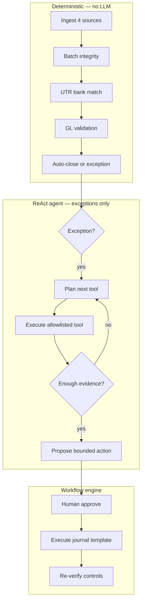

# Agent Architecture

## Is this agentic?

**Yes — as a bounded ReAct agent on exceptions only.**



## ReAct loop

On each investigation case, the agent:

1. Observes exception codes + settlement context
2. **Chooses** the next allowlisted tool (not a fixed script order)
3. Executes tool, appends result to context
4. Repeats until `finish` or `AGENT_MAX_STEPS` (default 6)
5. Synthesizes hypothesis from gathered evidence
6. Workflow engine maps to bounded action — **agent never posts money**

## Allowlisted tools (read-only)

| Tool | Purpose |
|------|---------|
| `calculate_batch` | Settlement Σcredit − Σdebit |
| `fetch_source_record` | Settlement or bank record |
| `search_candidate_records` | Bank candidates by amount |
| `get_policy` | Merchant matching/posting policy |
| `get_action_catalog` | Bounded action options |
| `finish_investigation` | LLM-only terminal tool |

## Two agent modes

| Mode | When | How |
|------|------|-----|
| `react_planner` | Default (no API key) | Adaptive planner picks next tool |
| `react_groq` | `USE_LLM=1` + `GROQ_API_KEY` | Groq function-calling ReAct loop |
| `react_llm` | `USE_LLM=1` + `OPENAI_API_KEY` | OpenAI function-calling ReAct loop |

Enable Groq mode (recommended):

```bash
export USE_LLM=1
export GROQ_API_KEY=gsk-your-key-from-console.groq.com
export GROQ_MODEL=llama-3.3-70b-versatile   # optional
streamlit run apps/streamlit_app.py
```

## Money safety boundary

| Layer | Owns |
|-------|------|
| Rules engine | Amounts, auto-close, UTR match, GL pass/fail |
| Agent | Which evidence to fetch, hypothesis, abstention |
| Workflow engine | Journal templates, approval, idempotent post |
| Human | Approve before any ledger write |

The LLM **cannot** call write tools, select account codes, or change control decisions.
