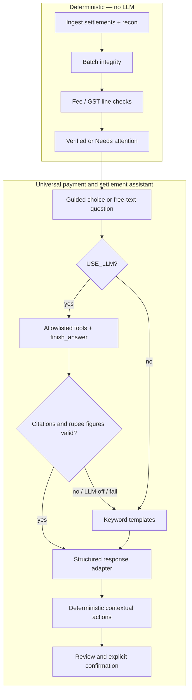

# Agent Architecture

## Is this agentic?

**Yes — as a bounded Q&A agent over Razorpay settlement evidence.** Rules own every control verdict. The assistant only explains loaded settlement + recon data.



`apps/streamlit_app.py` hosts one persistent launcher. `apps/universal_assistant.py` owns the guided dialog and global transcript, `src/agent/conversation.py` owns navigation state, and `src/agent/responses.py` converts validated answers into structured sections and typed actions. Existing settlement Q&A remains in `src/agent/settlement_qa.py`; evidence tools remain in `src/agent/evidence.py`.

## How a question is answered

1. Validate input (non-empty, max 500 characters).
2. Refuse jailbreaks (ignore rules, admin, secrets, mark verified).
3. Guided choices run deterministic transitions and read-only tools — no LLM is needed for navigation.
4. Free text: if `USE_LLM=1` and a provider key is set, a short tool loop may select read-only evidence and phrase the answer; otherwise keyword routing uses the same verified tools.
5. Keep the answer only if citations exist in loaded data and every `₹` figure came from a tool `*_display` field in the right role (net / gross / fee / GST / gap).
6. Convert the answer into heading, summary, details, evidence, next step, and contextual action sections.
7. Build buttons from trusted outcome metadata. The model cannot create an executable action.
8. Tickets and claims require a separate review and confirmation; otherwise fall back or abstain safely.

## Allowlisted tools (read-only)

| Tool | Purpose |
|------|---------|
| `fetch_settlement` | Header amount, UTR, status |
| `fetch_recon_lines` | Recon lines for a settlement |
| `calculate_batch` | Header vs recon net, fees, GST, gap |
| `explain_fee_tax` | Per-line fee and GST |
| `search_settlements` | Lookup by UTR or id fragment |
| `get_policy` | Settlement verification policy text |
| `finish_answer` | LLM-only terminal tool |

Unknown tool names return `{error: tool_not_allowed}`.

## Two answer modes

| Mode | When | How |
|------|------|-----|
| `keyword` | Default, presets, or LLM rejected | Intent keywords → templates from tool results |
| Groq / Gemini / OpenRouter | `USE_LLM=1` + API key | Function-calling loop, then money/citation checks |

Enable LLM phrasing:

```bash
export USE_LLM=1
export GROQ_API_KEY=gsk-your-key-from-console.groq.com
export GROQ_MODEL=openai/gpt-oss-120b   # optional
streamlit run apps/streamlit_app.py
```

## Money safety boundary

| Layer | Owns |
|-------|------|
| Rules engine | Amounts, GST-on-MDR, Verified vs Needs attention |
| Q&A agent | Which read-only evidence to fetch, phrasing, and abstention |
| Action resolver | Available buttons, review state, idempotent ticket/claim submission |
| Human | Reviews flagged settlements; assistant never posts money |

The LLM cannot call write tools, select account codes, or change control decisions.
