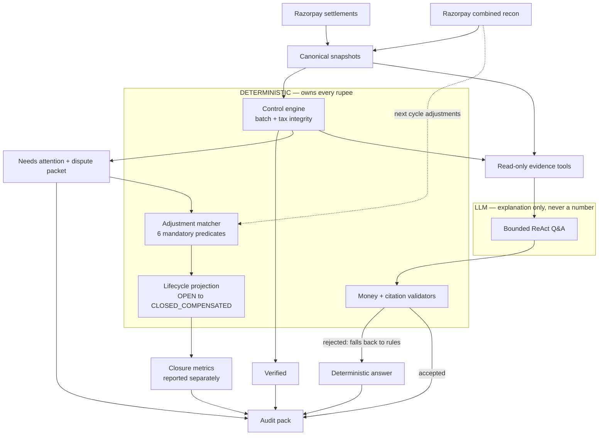

# Architecture

## Overview

Razorpay Settlement Assistant closes one finance-ops loop using **Razorpay data only**: ingest settlement + recon, verify batch and tax lines, answer merchant questions with evidence, export exceptions.

**Reading the trust boundary.** Everything inside DETERMINISTIC produces or approves
money. The LLM sits outside it and cannot write a figure, bind an adjustment, or change a
status: every model answer passes through the money and citation validators, and a
rejected answer falls back to the deterministic agent. The adjustment matcher is fully
deterministic by design — a hallucinated binding would silently mark a real financial
exception resolved.

Note the dashed edge: a corrective adjustment arrives in a *later* settlement than the
exception it compensates, so matching happens in a cross-settlement stage after the
per-settlement control loop, not inside it.

`settlement_integrity_rate` comes from `R` alone and is never touched by `P`. Closure is
a separate number: an adjustment compensates cash, it does not make a failed control pass.

## Components

| Module | Path | Responsibility |
|--------|------|----------------|
| Connectors | `src/connectors/` | Load Razorpay-shaped settlement + recon JSON |
| Domain | `src/domain/` | Pydantic models, exception codes |
| Controls | `src/controls/` | Batch integrity, tax-line integrity |
| Assistant | `src/agent/settlement_qa.py`, `src/agent/evidence.py` | Rule-based presets, bounded LLM Q&A, read-only evidence |
| Lifecycle | `src/lifecycle/` | Stable exception identity, deterministic adjustment matcher, lifecycle projection |
| Eval | `src/eval/` | Independent holdout, Q&A trust scorecard, lifecycle labels |
| Engine | `src/engine.py` | Orchestration, metrics, exception export |
| UI | `apps/streamlit_app.py` | Simple UI — summary, list, detail, preset + free-text Q&A |

## UI principles (final product)

- **One screen** — summary, list, detail; no tab maze  
- **Essential info only** — amount, date, UTR, Verified / Needs attention, plain issue  
- **Readable typography** — 16px+ body, 18–20px amounts, Inter/system sans-serif  
- **Plain English** — no internal codes on main view  
- **Q&A** — four preset buttons + free-text question box (500 char max)  
- **Auditor tools hidden** — download + technical metrics in collapsed expander only  

See [PLAN.md](PLAN.md) Section 3 (UI) and Section 12 (AI security).

## Control boundary

| Layer | Owns |
|-------|------|
| **Deterministic** | Amounts, batch math, GST-on-MDR checks, auto-close |
| **AI (non-binding)** | Q&A phrasing, evidence gathering, abstention |
| **Human** | Accepts flagged exceptions; no auto money movement |

## Tax-line integrity

Per payment line in recon:

- `credit == amount − fee`
- `tax ≈ round(fee × 18/118)` (±1 paise tolerance; fee is GST-inclusive)
- Batch rollup: fees and nets consistent with settlement header

## Settlement Q&A

**Presets (rule-based) + free text (Groq → Cerebras → keyword fallback).**

- Tools: `fetch_settlement`, `fetch_recon_lines`, `calculate_batch`, `explain_fee_tax`, `search_settlements`
- LLM providers: Groq primary, Cerebras fallback (`src/agent/llm_client.py`)
- User input is untrusted; see [security.md](security.md) and PLAN.md Section 12
- Every answer cites tool output; abstains when evidence missing
- Genuine unresolvable failures → simulated support ticket (`RZP-SUP-…`)
- AI cannot change control decisions

## Check failure display

When batch or tax-line controls FAIL, `ControlDecision.calculation_detail` carries:

- Formula, expected vs actual (INR), gap, line id, error message
- Rendered inline in Streamlit settlement detail (no vague "issue on pay_xxx" only)

## Money safety

- Integer paise throughout
- No LLM-authored amounts or tax calculations
- Auto-close only when batch + tax-line controls PASS
- False auto-closes target: 0

## Phase 2 (optional, not core)

- Bank CSV matching (UTR confirm)
- GL CSV three-way check
- Forward cash forecast from settlement schedule

See [PLAN.md](PLAN.md) for full product spec.
